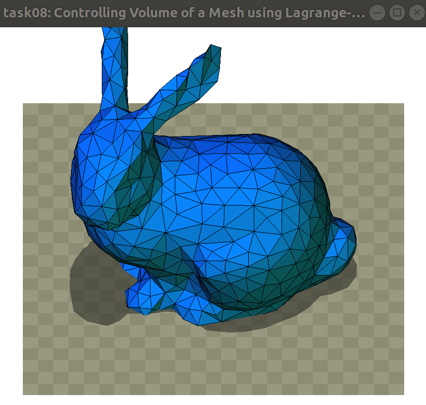

# Task08: Controlling Volume of a Mesh using Lagrange-Multiplier Method

**Deadline: June 22nd (Thu) at 15:00pm**

----

## Before Doing Assignment

If you have not done the [task00](../task00), do it first to set up the C++ graphics development environment.

Follow [this document](../doc/submit.md) to submit the assignment, In a nutshell, before doing the assignment,

- install `eigen` library following  [this document](../doc/setup_eigen.md)
- make sure you synchronized the `main ` branch of your local repository  to that of remote repository.
- make sure you created branch `task08` from `main` branch.
- make sure you are currently in the `task08` branch (use `git branch -a` command).

Now you are ready to go!

---

## Problem 1

Then, run the code. Take a screenshot image. 
Save the screenshot image overwriting `task08/problem1.png`

## Problem 2

This code means to inflate the bunny's mesh twice the volume while minimizing the elastic potential energy of the mass-spring system.
 
Write a few lines of code around `line #83` and `line #147` to set constraint to the volume using the Lagrangian multiplier method. Do not write complicated or long code.  

Save the screenshot image overwriting `task08/problem2.png`

Write down the elastic potential energy of spring shown in the standard output after the convergence below: 

***elastic potential energy == 0.299611***

## After Doing the Assignment

After modifying the code, push the code and submit a pull request.

## Notes

- Do not submit multiple pull requests. Only the first pull request is graded
- Do not close the pull request by yourself. The instructor will close the pull request
- If you mistakenly merge the pull request, it's OK, but be careful not to merge next time. 
